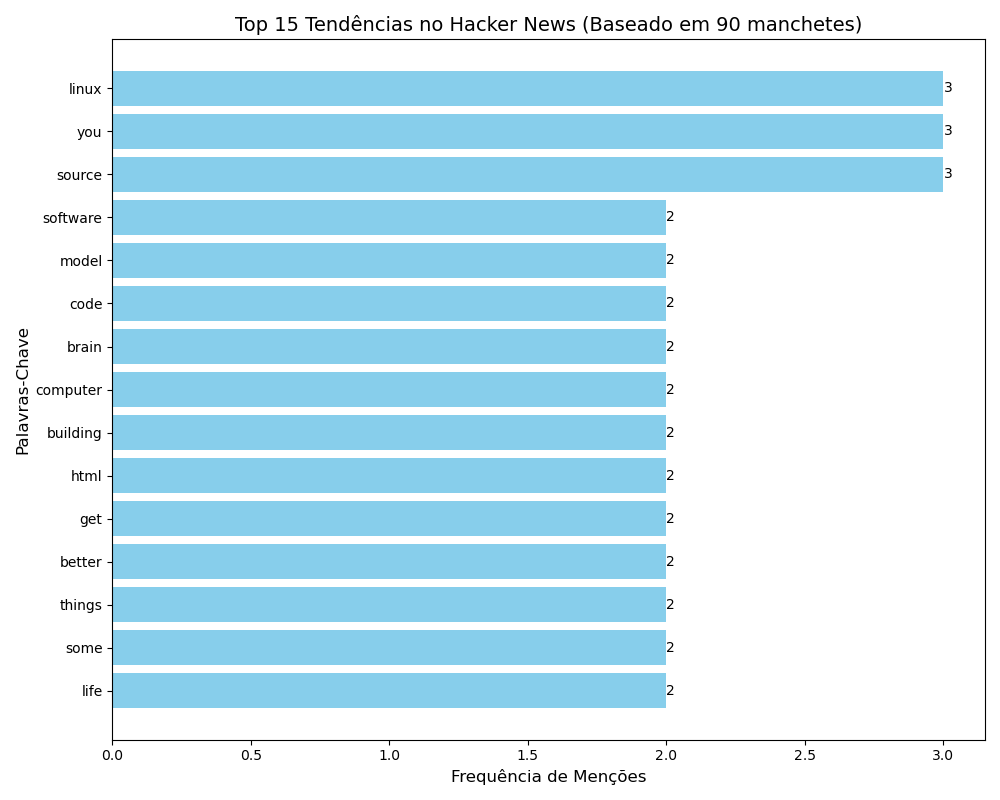

# 🕵️ HackerNews Stealth Scraper & Analyzer

Um pipeline de Engenharia de Dados com foco em privacidade que realiza operações de ETL anônimas no Hacker News, utilizando **roteamento da rede Tor** e **proxies SOCKS5**.

  

 

## 🚀 Principais Funcionalidades

* **Extração Anônima:** Roteia todas as requisições via SOCKS5/Tor para evitar rastreamento digital (fingerprinting).
* **Crawler Resiliente:** Implementa paginação, delays aleatórios ("comportamento humano") e rotação de User-Agent.
* **Pipeline ETL:**
    * **Extract:** Captura o HTML bruto.
    * **Transform:** Limpa os dados, remove ruídos (stop-words) e estrutura o texto.
    * **Load:** Persiste os dados em formato CSV estruturado.
* **Visualização:** Gera gráficos automáticos de análise de tendências.

## 🛠️ Tecnologias Utilizadas

* **Python 3.10+**
* **ProxyChains / Tor** (Infraestrutura de Rede)
* **Pandas & Matplotlib** (Análise de Dados)

## 📦 Como Executar

### ⚠️ Pré-requisito
Para que o modo anônimo funcione, você precisa ter o serviço **Tor** rodando na porta `9050` (padrão Linux/Mac) ou o **Tor Browser** aberto (porta `9150`).

1. **Instalar Dependências:**
   `pip install -r requirements.txt`

2. **Rodar o Extrator (Modo Seguro):**
   `MY_PROXY_URL="socks5h://127.0.0.1:9050" python3 etl_extractor.py`

3. **Visualizar os Resultados:**
   `python3 visualizer.py`
